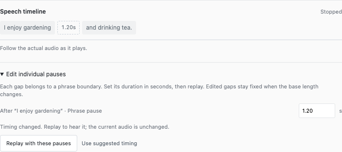
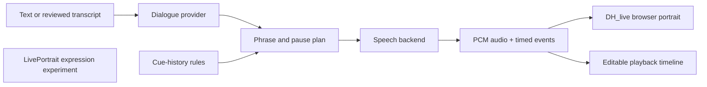

<div align="center">

# VOICE Avatar Lab

**A modular workbench for interactive portraits, speech timing, and virtual-patient research.**

[](https://github.com/Mingkai406/voice-avatar-lab/actions/workflows/checks.yml)


[](LICENSE)

[Quick start](#quick-start) · [Change the model](docs/model-providers.md) · [Architecture](docs/architecture.md) · [Contribute](CONTRIBUTING.md) · [Roadmap](docs/roadmap.md)

</div>

> **A working research prototype, not a validated clinical simulator.** The default full installation reproduces the local Qwen dialogue + Qwen3-TTS + DH_live workflow. Facial-expression generation is a separate experiment. No patient recordings or research participant data are included.

## What you can do

| Explore | Available now |
|---|---|
| Talk to a virtual character | Text input; local speech transcription in full mode; replay and stop |
| Shape speech rhythm | Preserve phrases; edit each pause independently; inspect the audio timeline |
| Compare voices | Local Qwen3-TTS and macOS system speech; adjustable pace and delivery |
| Swap dialogue models | Default MLX Qwen, an OpenAI-compatible API adapter, or your own provider |
| Test behavior logic | Transparent cue-history rules; scripted example mode for lightweight development |
| Explore expressions | Separate LivePortrait image controls for smile, eyebrows, gaze and head pose |



*Actual interface in recorded-example mode. Editing a gap changes the inserted silence on replay.*

## How the pieces connect



The dialogue model is replaceable. Speech generation, timing and portrait rendering have separate boundaries. LivePortrait is **not yet connected** to the talking portrait.

## Quick start

### Choose your starting point

| | Sample mode | Full mode |
|---|---|---|
| Best for | UI, pause logic, API integration and first contributions | Local AI dialogue, neural voice, transcription and expressions |
| Python | 3.12+ | Setup creates isolated Python 3.12 environments |
| Computer | No Python ML accelerator required; Chrome with WebGL | Apple Silicon Mac; reference machine: M4 Pro / 24 GB |
| Downloads | Upstream browser renderer; synthetic clips are in this repo | Renderer, pinned model weights and two Python environments |
| Conversation | **Scripted replies and recorded synthetic audio** | Local Qwen by default; configurable dialogue provider |
| Verification | Automated API tests; Chrome tested on macOS | Tested on the reference Mac; other Macs need validation |

Install [Git](https://git-scm.com/downloads) and [Python 3.12+](https://www.python.org/downloads/) first. Internet access is needed during setup. Use Chrome for the initial check.

```bash
git clone https://github.com/Mingkai406/voice-avatar-lab.git
cd voice-avatar-lab
```

**Sample mode — no Python ML packages:**

```bash
python3 scripts/setup.py --profile sample
python3 run.py --sample
```

**Full mode — the local Mac configuration:**

```bash
python3 scripts/setup.py --profile full
.venv/bin/python run.py
```

Open **http://127.0.0.1:8765**. Wait for the portrait and AI services to become ready. If that port is occupied, add `--port 8766`. On an installed Mac, `Start-Avatar-Lab.command` is also available.

Full setup downloads several GB; reserve at least **10 GB free** for weights, environments and temporary files. Setup can be rerun; it checks pinned source revisions and reuses completed downloads. It does not reset existing vendor checkouts. [Installation details and troubleshooting →](docs/installation.md)

### First interaction

1. Click **Interests** or **Offer a drink**.
2. Watch the **Speech timeline** follow speech and silence.
3. Expand **Edit individual pauses**, change a gap, then **Replay with these pauses**.
4. In full mode, select **Settings → Speech engine → Qwen3-TTS** to compare neural speech.

A useful starting configuration is **Aiden · Tentative · Word-finding speech · Event-based pauses · 600 ms base pause**. Try a nominal speech rate of 120–160, then tune by listening. These are example settings, not a clinical prescription. Rate 80 approximately doubles native neural-audio duration; silence and articulation speed are separate controls.

## Change the dialogue model without rewriting the app

The default is **Qwen2.5-1.5B-Instruct-4bit on MLX**. Keep it by leaving configuration unchanged.

For a service that implements `POST /chat/completions`, copy `.env.example` to `.env` and set:

```dotenv
AVATAR_LLM_PROVIDER=openai_compatible
AVATAR_LLM_BASE_URL=http://127.0.0.1:11434/v1
AVATAR_LLM_MODEL=your-installed-model-id
AVATAR_LLM_API_KEY=
```

Start the selected model service separately, then restart Avatar Lab. The example URL is illustrative; this project does not install or start that service. Hosted services may require a key and incur charges. **Keys remain server-side; `.env` is ignored by Git.** Dialogue text goes to the provider you configure.

This adapter expects a standard text `choices[0].message.content` response. Provider-specific reasoning parameters, tool calls and streaming are not implemented. The API contract is tested against a mock endpoint; individual external services still require integration testing.

[Provider guide and extension template →](docs/model-providers.md)

## What powers it

| Layer | Default / implementation | Upstream |
|---|---|---|
| Dialogue | Qwen2.5 1.5B, MLX; replaceable provider | [MLX LM](https://github.com/ml-explore/mlx-lm) · [Model](https://huggingface.co/mlx-community/Qwen2.5-1.5B-Instruct-4bit) |
| Neural speech | Qwen3-TTS 1.7B CustomVoice, 6-bit MLX conversion | [Qwen3-TTS](https://github.com/QwenLM/Qwen3-TTS) · [MLX Audio](https://github.com/Blaizzy/mlx-audio) |
| Speech recognition | faster-whisper / tiny.en, CPU | [faster-whisper](https://github.com/SYSTRAN/faster-whisper) |
| Talking portrait | DH_live browser runtime and upstream sample assets | [DH_live](https://github.com/kleinlee/DH_live) |
| Expression experiment | LivePortrait, single-frame controls | [LivePortrait](https://github.com/KlingAIResearch/LivePortrait) |
| Application logic | Cue state, phrase plans, editable silence, audio-clock playback | [`src/avatar_lab/`](src/avatar_lab) · [`public/`](public) |

Exact source and model revisions are recorded in [`models.lock.json`](models.lock.json). The project downloads upstream portrait assets during setup; it does not bundle model weights or grant rights to the sample likenesses. See [third-party notices](THIRD_PARTY_NOTICES.md).

## Develop together

| Workstream | Start here | A useful first contribution |
|---|---|---|
| Dialogue and patient behavior | `providers.py`, `behavior_plan.py` | Add a provider test or improve cue-state handling |
| Speech and timing | `speech_timing.py`, `neural_speech*.py` | Compare timing accuracy and abnormal-generation handling |
| Avatar and expressions | `renderer-bridge.js`, `portrait_model.py` | Test an alternative renderer behind the same audio boundary |
| Interface and evaluation | `public/app.js`, `docs/api.md` | Improve editing, event export or accessibility |
| Reproducibility | `scripts/`, `tests/` | Verify setup on another machine and report exact conditions |

**Fork → branch → test → pull request → review → merge.** Public users can fork without being added as collaborators. Contributors with write access may use branches in this repository. Read [CONTRIBUTING.md](CONTRIBUTING.md) before your first PR.

```bash
python3 -m unittest discover -s tests -v
python3 scripts/check_repository.py
```

CI checks Python behavior, API boundaries, example integrity, local documentation links, and JavaScript syntax. It does **not** establish GPU performance, visual quality or clinical validity. Model-changing PRs should attach a manual evaluation summary.

## Current boundaries

- Turn-based generation: audio is prepared before playback; automatic full-duplex interruption is not implemented.
- Neural speech can produce abnormal endings. Duration checks retry once, then report an error; this is not comprehensive quality assurance.
- Idle motion comes from source video. Mouth weights are not semantic emotion controls.
- Cue-state and pause rules are illustrative. A real patient-behavior model needs expert-grounded data and evaluation.
- Full inference currently targets Apple Silicon. Windows/Linux contributors can use sample mode; NVIDIA deployment is a future adapter path.
- This is a loopback development server with no authentication or multi-user isolation. **GitHub hosts the code, not a running AI service.** Do not expose this server directly to the public internet.

[Roadmap and support needed](docs/roadmap.md) · [Sharing and deployment](docs/sharing.md) · [Security reporting](SECURITY.md)

## License and acknowledgements

Project-authored code is MIT licensed. Upstream code, model weights, preset voices and portrait assets retain their own terms; the repository license does not relicense them. In particular, DH_live distinguishes code licensing from portrait/commercial authorization. Keep upstream marks intact.

Built with the work of the DH_live, LivePortrait, Qwen, MLX and faster-whisper communities. This repository is an experimental companion to VOICE, not an official release of those upstream projects or an institution-endorsed clinical product.
