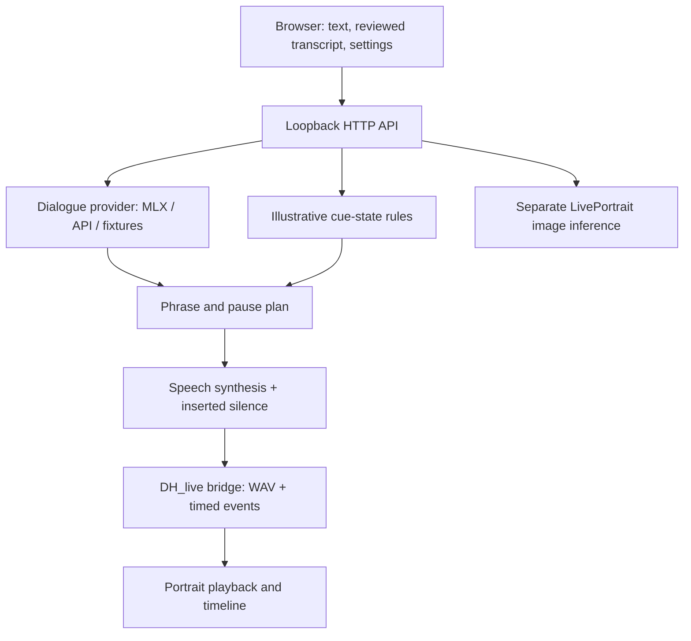

# Architecture and module ownership

| Directory / module | Responsibility | Avoid coupling to |
|---|---|---|
| `public/` | Interface, audio-clock events, renderer bridge | LLM credentials or Python model internals |
| `src/avatar_lab/providers.py` | Text model initialization and generation | Voice selection, face parameters |
| `behavior_plan.py` | Cue state, phrase boundaries, pause event labels | Neural renderer internals |
| `speech_timing.py` | Canonical audio assembly and measured segment times | Assumed natural-language emotion accuracy |
| `neural_speech*.py` | Persistent Qwen3-TTS worker and bounded quality retry | Browser state |
| `portrait_model.py` | Independent expression image generation | Live talking portrait until an integration is implemented |
| `voice_adapter.py` | Existing VOICE raw-PCM boundary | Production credentials or deployment assumptions |
| `scripts/` | Setup, diagnostics and provenance | Research participant data |
| `tests/` | Provider, timing, API and fixture contracts | Paid endpoints / GPU availability |

## Relationship to VOICE

This repository is a standalone companion prototype. It does not include the production React/AWS/Unity application, authentication, case management or evaluation system. The raw-audio adapter is an integration boundary, not evidence that a production deployment has been completed. Emotion and motion codes imported from VOICE are recorded but not applied.

## Current interaction model

A complete response is generated and synthesized before playback. The browser audio clock drives segment indicators and pause state. Cancellation invalidates late results so old audio does not restart. It does not cancel inference already running on the server. Recording is explicitly started/stopped, and the transcript is reviewed before sending.

State travels with each browser request. This development server still lacks admission control, session authentication and tested concurrent model scheduling. Do not treat it as a multi-user service.
